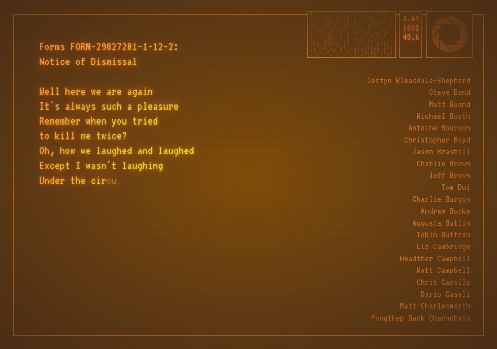

# Portal 2 Credits

Web-based Portal 2 ending credits recreated with HTML, CSS, and Javascript.

I built this using a YouTube video of the credits for reference (I did manually type every name in the credits). It's mildly responsive. A couple small aesthetic choices were made that diverge from the original.

Live at [https://christopher-hayes.github.io/portal-2-credits/portal-2-ending.html](https://christopher-hayes.github.io/portal-2-credits/portal-2-ending.html)

Credit to [@Screwtapello@teh.entar.net](https://teh.entar.net/@Screwtapello/113848235903486857) for creating the TTF font used in this project. It's a [conversion of the original font files]((https://gitlab.com/Screwtapello/vt320-font-extractor/-/blob/main/README.md)) from the DEC [VT320](https://en.wikipedia.org/wiki/VT320) terminal. This isn't like a Portal lore thing, I just think the font is cool.
